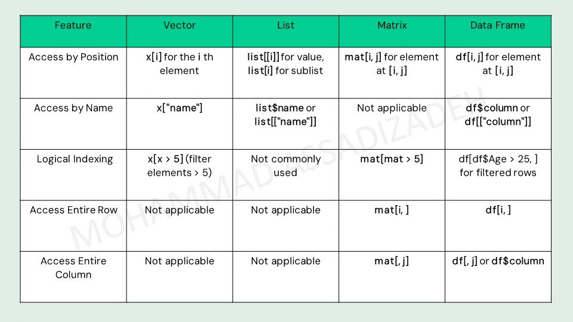

# Data Structures

When working with data sets, we need to use data structures to store and manipulate data.


1. vectors
2. vector functions
3. vector arithmetics
4. lists
5. matrices
6. DataFrames
7. DataFrame operations


### Vector

A vector is a basic data structure in R. It is a sequence of elements of the same type.

To create a vector, we need to use the `c()` function and separate the elements by commas.

To access an element of the vector, we need to refer to it using its index in square brackets.


```python
Genes <- c("gene1" = "CFTR", "gene2" ="CLCN1","gene3" = "CCDC40")
print(Genes)
```

       gene1    gene2    gene3 
      "CFTR"  "CLCN1" "CCDC40" 


```python
Expression <- c("CFTR" = 12, "CLCN1" = 122, "CCDC40" = 3)
print(Expression)
```

      CFTR  CLCN1 CCDC40 
        12    122      3 


Numerical indexing


```python
Genes <- c("CFTR", "CLCN1", "CCDC40")
print(Genes[4])
```

    [1] NA


min:max


```python
Genes <- c("CFTR", "CLCN1", "CCDC40", "SLC38A10")
print(Genes[1:2])
#specify a range
```

    [1] "CFTR"  "CLCN1"


```python
Genes <- c("CFTR", "CLCN1", "CCDC40", "SLC38A10")
print(Genes[-1])
#negetive index to skip an element
```

    [1] "CLCN1"    "CCDC40"   "SLC38A10"


Named indexing (character indexing)


```python
expression <- c("CFTR"=10, "CLCN1"=0.5, "CCDC40"=234)
print(expression["CLCN1"])
```

    CLCN1 
      0.5 


```python
age <- c("nima" =12,"ali" =22,"mohammad"= 34,"jack"= 76)
print(age["nima"])
```

    nima 
      12 


Logical indexing


```python
#filtering
expression <- c("CFTR"=10, "CLCN1"=0.5, "CCDC40"=234)
print(expression[expression > 100])
```

    CCDC40 
       234 


### Vector functions


```python
Genes <- c("CFTR", "CLCN1", "CCDC40", "SLC38A10")
print(length(Genes))
```

    [1] 4


```python
x <- c(4, 8, 42, 1, 6)
print(sum(x))
```

    [1] 61


```python
x <- c(4, 8, 42, 1, 6)
y <- sort(x)
print(y)
```

    [1]  1  4  6  8 42


```python
chroNum <- c("chro" = 1, "chro" =4, "chro" =5, "chro" =2, "chro" =8)
print(sort(chroNum))
```

    chro chro chro chro chro 
       1    2    4    5    8 


```python
#creation of a vector of consecutive numbers
x <- 3:9
print(x)
```

    [1] 3 4 5 6 7 8 9


```python
#seq function to creat vectors of number
x <- seq(1, 10, by=2)
print(x)
```

    [1] 1 3 5 7 9


```python
x <- c(1, 3, 5, 7, 9)
print(x)
```

    [1] 1 3 5 7 9


```python
x = seq(1, 100, by=2)
print(x[x < 50])
```

     [1]  1  3  5  7  9 11 13 15 17 19 21 23 25 27 29 31 33 35 37 39 41 43 45 47 49


```python
#change a value of an element
x <- 1:5
x[2] <- 66
print(x)
```

    [1]  1 66  3  4  5


```python
expression <- c("CFTR"=10, "CLCN1"=0.5, "CCDC40"=234)

expression["CFTR"] <- 12

print(expression)
```

      CFTR  CLCN1 CCDC40 
      12.0    0.5  234.0 


### Vector Arithmetics

Two vectors of the same length can be added, subtracted, multiplied or divided resulting in a new vector.


```python
v1 <- c(2, 6, 1, 5)
v2 <- c(5, 3, 4, 8)
```


```python
#addition
print(v1+v2)
```

    [1]  7  9  5 13


```python
#subtraction
print(v1-v2)
```

    [1] -3  3 -3 -3


```python
#multiplication
print(v1*v2)
```

    [1] 10 18  4 40


```python
#division
print(v1/v2)
```

    [1] 0.400 2.000 0.250 0.625


```python
v <- c(2, 6, 1, 5, 42)
print(mean(v))
```

    [1] 11.2


```python
v <- c(2, 6, 1, 5, 42)
print(median(v))
```

    [1] 5


#### exercise: a function that translate a DNA squence to protein sequence using vectors


```python
codons <- c(
  "UUU" = "F", "UUC" = "F",               # Phenylalanine
  "UUA" = "L", "UUG" = "L", "CUU" = "L", "CUC" = "L", "CUA" = "L", "CUG" = "L", # Leucine
  "AUU" = "I", "AUC" = "I", "AUA" = "I",               # Isoleucine
  "AUG" = "M",                            # Methionine (Start Codon)
  "GUU" = "V", "GUC" = "V", "GUA" = "V", "GUG" = "V",  # Valine
  "UCU" = "S", "UCC" = "S", "UCA" = "S", "UCG" = "S",  # Serine
  "CCU" = "P", "CCC" = "P", "CCA" = "P", "CCG" = "P",  # Proline
  "ACU" = "T", "ACC" = "T", "ACA" = "T", "ACG" = "T",  # Threonine
  "GCU" = "A", "GCC" = "A", "GCA" = "A", "GCG" = "A",  # Alanine
  "UAU" = "Y", "UAC" = "Y",               # Tyrosine
  "UAA" = "*", "UAG" = "*", "UGA" = "*",  # Stop Codons
  "CAU" = "H", "CAC" = "H",               # Histidine
  "CAA" = "Q", "CAG" = "Q",               # Glutamine
  "AAU" = "N", "AAC" = "N",               # Asparagine
  "AAA" = "K", "AAG" = "K",               # Lysine
  "GAU" = "D", "GAC" = "D",               # Aspartic Acid
  "GAA" = "E", "GAG" = "E",               # Glutamic Acid
  "UGU" = "C", "UGC" = "C",               # Cysteine
  "UGG" = "W",                            # Tryptophan
  "CGU" = "R", "CGC" = "R", "CGA" = "R", "CGG" = "R",  # Arginine
  "AGU" = "S", "AGC" = "S",               # Serine
  "AGA" = "R", "AGG" = "R",               # Arginine
  "GGU" = "G", "GGC" = "G", "GGA" = "G", "GGG" = "G"   # Glycine
)

```


```python
print(codons["AGG"])
```

    AGG 
    "R" 


```python
translation <- function(x) {
  print(codons[x])
}

translation("UGU")
translation("AGU")
translation("GGU")
```

    UGU 
    "C" 
    AGU 
    "S" 
    GGU 
    "G" 


```python
translation2 <- function(x) {
  protein <- ""

  for (i in seq(1, nchar(x), by = 3)) {
    codon <- substr(x, i, i + 2)
    amino_acid <- codons[codon]
    if (!is.na(amino_acid)) {
      protein <- paste0(protein, amino_acid)
    } else {
      protein <- paste0(protein, "?")
    }
  }

  # Print the translated protein sequence
  print(protein)
}

# Example usage
translation2("AUGGGGAUUGCGCAUCAUUUUACGGCA")
```

    [1] "MGIAHHFTA"


### list

Vectors can only hold elements of the same type.

Lists are another data structure in R, that are similar to vectors, but can hold different types of data.

A list can also contain a matrix or a function as its elements.

A list can be created using the `list()` function:


```python
x <- list("Gene1", "rs103245", c(2, 4, 8), 42)
print(x)
```

    [[1]]
    [1] "Gene1"
    
    [[2]]
    [1] "rs103245"
    
    [[3]]
    [1] 2 4 8
    
    [[4]]
    [1] 42
    


```python
print(x[[2]])
```

    [1] "rs103245"


**named indexing of lists**

When using named elements, an alternative to `[["element_name"]]`, which is used often while accessing content of a list, is the `$` operator.


```python
x <- list("name"="Ali", "age"=21, "gender"=1, "married"=FALSE)
print(x$name)
```

    [1] "Ali"


```python
x <- list("name"="Ali", "age"=21, "gender"=1, "married"=FALSE, 21)
x[["university"]] <- "SBU"
print(x)
```

    $name
    [1] "Ali"
    
    $age
    [1] 21
    
    $gender
    [1] 1
    
    $married
    [1] FALSE
    
    [[5]]
    [1] 21
    
    $university
    [1] "SBU"
    


### list operations


```python
#merging two lists

list1 <- list("A", "B", "C")
print(list1)
```

    [[1]]
    [1] "A"
    
    [[2]]
    [1] "B"
    
    [[3]]
    [1] "C"
    


```python
list2 <- list("D", "E")
print(list2)
```

    [[1]]
    [1] "D"
    
    [[2]]
    [1] "E"
    


```python
x <- c(list1, list2)
print(x)
```

    [[1]]
    [1] "A"
    
    [[2]]
    [1] "B"
    
    [[3]]
    [1] "C"
    
    [[4]]
    [1] "D"
    
    [[5]]
    [1] "E"
    


```python
#convert list to vector to operate vector functions on them

x <- list(4, 2, 11)
y <- unlist(x)

print(sort(y))
print(mean(y))
```

    [1]  2  4 11
    [1] 5.666667


```python
# Create a heterogeneous list
my_list <- list(
  numbers = c(1, 2, 3, 4),                   # Numeric vector
  text = "Hello, World!",                     # Character string
  matrix_data = matrix(1:9, nrow = 3),        # Matrix
  data_frame = data.frame(A = 1:3, B = letters[1:3]),  # Data frame
  boolean = TRUE,
  22,
  150                             # Logical value
)

# Print the list
print(my_list)

```

    $numbers
    [1] 1 2 3 4
    
    $text
    [1] "Hello, World!"
    
    $matrix_data
         [,1] [,2] [,3]
    [1,]    1    4    7
    [2,]    2    5    8
    [3,]    3    6    9
    
    $data_frame
      A B
    1 1 a
    2 2 b
    3 3 c
    
    $boolean
    [1] TRUE
    
    [[6]]
    [1] 22
    
    [[7]]
    [1] 150
    


### matrix

A matrix is a two dimensional data set with rows and columns. It is similar to a vector, but has an additional dimension.

A matrix can be created with the `matrix()` function, specifying the rows and columns using the `nrow` and `ncol` parameters.


```python
x <- matrix(c(1,2,3,4,5,6), nrow = 2, ncol = 3)
print(x)
```

         [,1] [,2] [,3]
    [1,]    1    3    5
    [2,]    2    4    6


```python
y <- matrix(1:10, nrow = 5, ncol = 2)
print(y)
```

         [,1] [,2]
    [1,]    1    6
    [2,]    2    7
    [3,]    3    8
    [4,]    4    9
    [5,]    5   10


access elements of the matrix by specifying the row and the column in square brackets

`print(x[row, col])`


```python
z <- matrix(c(1,2,3,4,5,6), nrow = 2, ncol = 3)
```


```python
print(z)
```

         [,1] [,2] [,3]
    [1,]    1    3    5
    [2,]    2    4    6


```python
print(z[1, 2])
```

    [1] 3


access a whole row or column by specifying its number and skipping the column.

`print(x[row,])`

`print(x[, col])`


```python
x <- matrix(c(1,2,3,4,5,6), nrow = 2, ncol = 3)
```


```python
print(x)
```

         [,1] [,2] [,3]
    [1,]    1    3    5
    [2,]    2    4    6


```python
#row
print(x[1,])
```

    [1] 1 3 5


```python
#col
print(x[,1])
```

    [1] 1 2


We can transpose a matrix in R with the function `t()`


```python
x <- matrix(c(1,2,3,4,5,6), nrow = 2, ncol = 3)
```


```python
print(x)
```

         [,1] [,2] [,3]
    [1,]    1    3    5
    [2,]    2    4    6


```python
print(t(x))
```

         [,1] [,2]
    [1,]    1    2
    [2,]    3    4
    [3,]    5    6


### data frames

What if we want to store different types of elements in 2 dimensions?
That's where the most important data structure of R comes in: a **DataFrame** .

A data frame is a table, where **each column has a name** and can contain any type of data.

Each column must contain the **same number** of data items.

We can create a data frame using the `data.frame()` function.


```python
x <- data.frame("id" = 1:2, "name" = c("James", "Amy"),  "age" = c(42,18))
print(x)
```

      id  name age
    1  1 James  42
    2  2   Amy  18


```python
annotation_df <- data.frame(
  ID = 1:5,
  Gene = c("Gene1", "Gene2", "Gene3", "Gene4", "Gene5"),
  Expression = c(120, 45, 310, 150, 90),
  GC_Content = c(52.5, 45.0, 60.3, 55.8, 48.9),
  Type = c("Enzyme", "Regulator", "Transporter", "Enzyme", "Structural")
)

print(annotation_df)
```

      ID  Gene Expression GC_Content        Type
    1  1 Gene1        120       52.5      Enzyme
    2  2 Gene2         45       45.0   Regulator
    3  3 Gene3        310       60.3 Transporter
    4  4 Gene4        150       55.8      Enzyme
    5  5 Gene5         90       48.9  Structural


**Indexing**


```python
#second column
print(annotation_df[[2]])
```

    [1] "Gene1" "Gene2" "Gene3" "Gene4" "Gene5"


```python
print(annotation_df[,2])
```

    [1] "Gene1" "Gene2" "Gene3" "Gene4" "Gene5"


```python
print(annotation_df[2])
```

       Gene
    1 Gene1
    2 Gene2
    3 Gene3
    4 Gene4
    5 Gene5


```python
print(annotation_df[2,])
```

      ID  Gene Expression GC_Content      Type
    2  2 Gene2         45         45 Regulator


```python
print(annotation_df[2, 3])
```

    [1] 45


Named indexing

You can access elements of a data frame using `[[]]` or the `$` operator, using the name of the column.


```python
#the name column
print(annotation_df[["Type"]])
```

    [1] "Enzyme"      "Regulator"   "Transporter" "Enzyme"      "Structural" 


```python
#the same as
print(annotation_df$GC_Content )
```

    [1] 52.5 45.0 60.3 55.8 48.9


Logical indexing or filtering


```python
print(annotation_df[annotation_df[["GC_Content"]]>50.0, ])
#print(annotation_df[annotation_df$GC_Content<50.0, ])
```

      ID  Gene Expression GC_Content        Type
    1  1 Gene1        120       52.5      Enzyme
    3  3 Gene3        310       60.3 Transporter
    4  4 Gene4        150       55.8      Enzyme


```python
#filter by subset function

print(subset(annotation_df, GC_Content> 60 ))
```

      ID  Gene Expression GC_Content        Type
    3  3 Gene3        310       60.3 Transporter


### dataframe operations


```python
#R dataframes can be examined using the summary function. It outputs the summary statistics for each of the columns

summary(annotation_df)
```


           ID        Gene             Expression    GC_Content       Type          
     Min.   :1   Length:5           Min.   : 45   Min.   :45.0   Length:5          
     1st Qu.:2   Class :character   1st Qu.: 90   1st Qu.:48.9   Class :character  
     Median :3   Mode  :character   Median :120   Median :52.5   Mode  :character  
     Mean   :3                      Mean   :143   Mean   :52.5                     
     3rd Qu.:4                      3rd Qu.:150   3rd Qu.:55.8                     
     Max.   :5                      Max.   :310   Max.   :60.3                     


You can add a new column to a dataframe by simply assigning it a vector of values.


```python
#adding a column

annotation_df$Chromosome <- c(1, 9, 5, 7, 2)

print(annotation_df)
```

      ID  Gene Expression GC_Content        Type Chromosome
    1  1 Gene1        120       52.5      Enzyme          1
    2  2 Gene2         45       45.0   Regulator          9
    3  3 Gene3        310       60.3 Transporter          5
    4  4 Gene4        150       55.8      Enzyme          7
    5  5 Gene5         90       48.9  Structural          2


```python
print(mean(annotation_df$GC_Content))
```

    [1] 52.5


**Indexing Summary**



