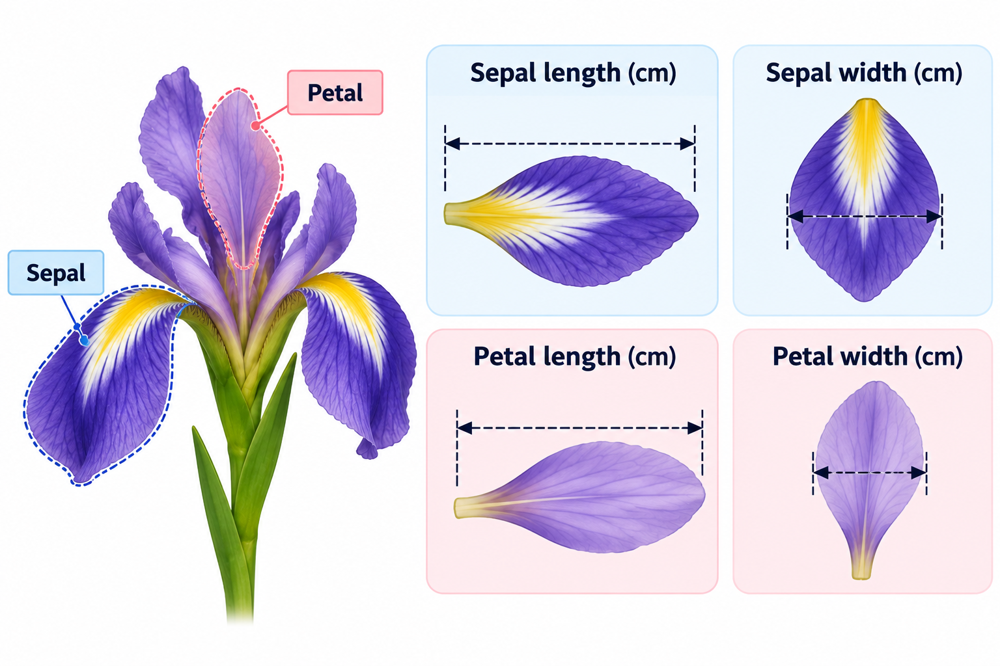
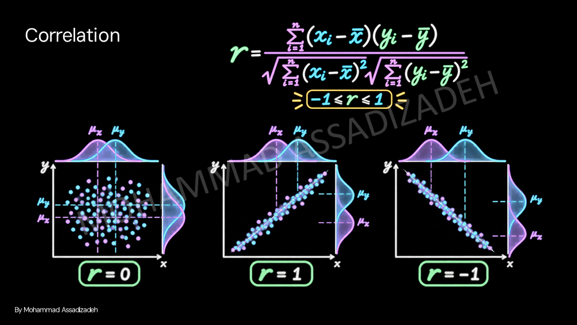
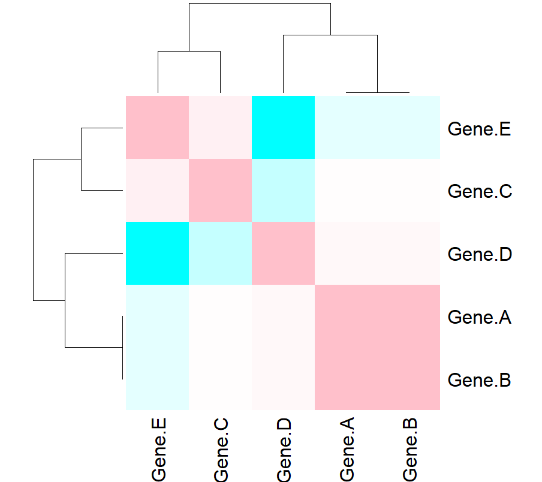
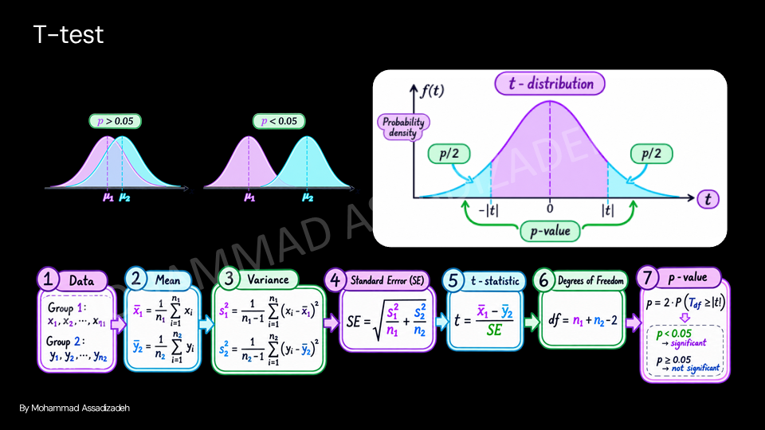

# Data analysis

-  importing data and biological datasets
-  Basic statistics
-  Logical filtering
-  working with data


## genetic variants dataset


```python
data <- read.csv("Variants.csv")
```


```python
head(data, 6)
```

   Variant Chromosome Position Gene Ref Alt   Mutation Impact
1 rs123456          1   123456 ABC1   A   G   Missense      1
2 rs789012          2   234567 ABC2   C   T     Silent      0
3 rs345678          3   345678 ABC3   G   A Frameshift      4
4 rs567890          4   456789 ABC4   T   C   Missense      5
5 rs910111          5   567890 ABC5   A   T  Insertion      6
6 rs234567          6   678901 ABC6   G   C   Deletion      8
  Clinical.Significance
1                     4
2                     1
3                     5
4                     2
5                     3
6                     0


```python
summary(data)
```


       Variant            Chromosome       Position          Gene          
     Length:60          Min.   : 1.00   Min.   :101234   Length:60         
     Class :character   1st Qu.: 5.75   1st Qu.:234567   Class :character  
     Mode  :character   Median :10.50   Median :505678   Mode  :character  
                        Mean   :10.50   Mean   :513944                     
                        3rd Qu.:15.25   3rd Qu.:789012                     
                        Max.   :20.00   Max.   :909012                     
         Ref                Alt              Mutation             Impact      
     Length:60          Length:60          Length:60          Min.   :  0.00  
     Class :character   Class :character   Class :character   1st Qu.:  4.00  
     Mode  :character   Mode  :character   Mode  :character   Median :  6.00  
                                                              Mean   : 21.78  
                                                              3rd Qu.: 22.50  
                                                              Max.   :100.00  
     Clinical.Significance
     Min.   :0.000        
     1st Qu.:1.000        
     Median :2.000        
     Mean   :2.433        
     3rd Qu.:4.000        
     Max.   :5.000        


#### Basic statistics


```python
mean(data$Impact)
```


21.7833333333333


**Variance** is how much each numbers in a set differs from the average.

$$ \text{Var}(X) = \frac{1}{N} \sum_{i=1}^{N} (x_i - \mu)^2 $$


Where $μ$ is the mean of the numbers and $x_i$ are the individual numbers.


```python
var(data$Impact)
```


1019.73192090395


The **standard deviation** **(SD)** is the square root of the variance.

$$ \sigma = \sqrt{\text{Var}(X)} $$


```python
sd(data$Impact)
```


31.9332416284967


## iris built-in dataset



```python
head(iris, 6)
```

  Sepal.Length Sepal.Width Petal.Length Petal.Width Species
1          5.1         3.5          1.4         0.2  setosa
2          4.9         3.0          1.4         0.2  setosa
3          4.7         3.2          1.3         0.2  setosa
4          4.6         3.1          1.5         0.2  setosa
5          5.0         3.6          1.4         0.2  setosa
6          5.4         3.9          1.7         0.4  setosa


```python
summary(iris)
```


      Sepal.Length    Sepal.Width     Petal.Length    Petal.Width   
     Min.   :4.300   Min.   :2.000   Min.   :1.000   Min.   :0.100  
     1st Qu.:5.100   1st Qu.:2.800   1st Qu.:1.600   1st Qu.:0.300  
     Median :5.800   Median :3.000   Median :4.350   Median :1.300  
     Mean   :5.843   Mean   :3.057   Mean   :3.758   Mean   :1.199  
     3rd Qu.:6.400   3rd Qu.:3.300   3rd Qu.:5.100   3rd Qu.:1.800  
     Max.   :7.900   Max.   :4.400   Max.   :6.900   Max.   :2.500  
           Species  
     setosa    :50  
     versicolor:50  
     virginica :50  
                    
                    
                    


#### Logical data filtering


```python
setosa <- iris[iris$Species == "setosa",]
#find the row that corresponds to setosa
```

```python
head(setosa)
```

```text
  Sepal.Length Sepal.Width Petal.Length Petal.Width Species
1          5.1         3.5          1.4         0.2  setosa
2          4.9         3.0          1.4         0.2  setosa
3          4.7         3.2          1.3         0.2  setosa
4          4.6         3.1          1.5         0.2  setosa
5          5.0         3.6          1.4         0.2  setosa
6          5.4         3.9          1.7         0.4  setosa
```


```python
length(iris[iris$Species == "setosa",])
```

```text
[1] 5
```


```python
nrow(iris[iris$Species == "setosa",])
```

```text
[2] 50
```


Multiple condition filtering


```python
x <- iris[iris$Species == "setosa" & iris$Sepal.Width > 4,]
```


```python
print(x)
```

       Sepal.Length Sepal.Width Petal.Length Petal.Width Species
    16          5.7         4.4          1.5         0.4  setosa
    33          5.2         4.1          1.5         0.1  setosa
    34          5.5         4.2          1.4         0.2  setosa


## Gene expression datasets

```python
trans <- read.csv("Expression.csv")
```


```python
print(trans)
```

       Person Gene.A Gene.B Gene.C Gene.D Gene.E Cancer
    1     P01     50     60    100     45     50      0
    2     P02     52     62    101     47     48      0
    3     P03     48     63    102     46     49      0
    4     P04     51     58    103     44     51      0
    5     P05     50     60    100     45     50      0
    6     P06    120    190    100     45     50      1
    7     P07    125    195    101     47     48      1
    8     P08    122    192    102     46     49      1
    9     P09    118    188    103     44     51      1
    10    P10    121    191    100     45     50      1
    11    P11     51     59    100     45     50      0
    12    P12     53     61    101     47     48      0
    13    P13     49     57    102     46     49      0
    14    P14     50     58    103     44     51      0
    15    P15     52     60    100     45     50      0
    16    P16    130    200    100     45     50      1
    17    P17    128    198    101     47     48      1
    18    P18    126    196    102     46     49      1
    19    P19    124    194    103     44     51      1
    20    P20    129    199    100     45     50      1
    21    P21     49     61    100     45     50      0
    22    P22     51     59    101     46     49      0
    23    P23     50     62    102     47     48      0
    24    P24     52     60    103     44     51      0
    25    P25     48     58    100     45     50      0
    26    P26    123    193    101     47     48      1
    27    P27    127    197    102     46     49      1
    28    P28    125    195    103     44     51      1
    29    P29    122    192    100     45     50      1
    30    P30    130    200    101     47     48      1


```python
summary(trans)
```


        Person              Gene.A           Gene.B          Gene.C     
     Length:30          Min.   : 48.00   Min.   : 57.0   Min.   :100.0  
     Class :character   1st Qu.: 50.25   1st Qu.: 60.0   1st Qu.:100.0  
     Mode  :character   Median : 85.50   Median :125.5   Median :101.0  
                        Mean   : 87.53   Mean   :127.3   Mean   :101.2  
                        3rd Qu.:124.75   3rd Qu.:194.8   3rd Qu.:102.0  
                        Max.   :130.00   Max.   :200.0   Max.   :103.0  
         Gene.D          Gene.E          Cancer   
     Min.   :44.00   Min.   :48.00   Min.   :0.0  
     1st Qu.:45.00   1st Qu.:49.00   1st Qu.:0.0  
     Median :45.00   Median :50.00   Median :0.5  
     Mean   :45.47   Mean   :49.53   Mean   :0.5  
     3rd Qu.:46.00   3rd Qu.:50.00   3rd Qu.:1.0  
     Max.   :47.00   Max.   :51.00   Max.   :1.0  


#### correlation matrix

- A correlation matrix is used in data analytics to find the dependence between multiple columns.

- A correlation value close to **1** shows that the compared columns are **highly correlated**, while a value close to **0** shows that they are **less correlated**.



- You can find the correlation matrix using the `cor()` function.


```python
cor_gene <- cor(trans)
```


    Error in cor(trans): 'x' must be numeric
    Traceback:


    1. stop("'x' must be numeric")

    2. .handleSimpleError(function (cnd) 
     . {
     .     watcher$capture_plot_and_output()
     .     cnd <- sanitize_call(cnd)
     .     watcher$push(cnd)
     .     switch(on_error, continue = invokeRestart("eval_continue"), 
     .         stop = invokeRestart("eval_stop"), error = invokeRestart("eval_error", 
     .             cnd))
     . }, "'x' must be numeric", base::quote(cor(trans)))


```python
print(cor_gene <- cor(trans[-1]))
```

                Gene.A      Gene.B      Gene.C      Gene.D      Gene.E      Cancer
    Gene.A  1.00000000  0.99905423  0.02130964  0.08436662 -0.08436662  0.99731623
    Gene.B  0.99905423  1.00000000  0.02248845  0.08012629 -0.08012629  0.99914601
    Gene.C  0.02130964  0.02248845  1.00000000 -0.22775078  0.22775078  0.02909880
    Gene.D  0.08436662  0.08012629 -0.22775078  1.00000000 -1.00000000  0.06311944
    Gene.E -0.08436662 -0.08012629  0.22775078 -1.00000000  1.00000000 -0.06311944
    Cancer  0.99731623  0.99914601  0.02909880  0.06311944 -0.06311944  1.00000000


```python
trans_numeric <- trans[2:6]
print(trans_numeric)
```

       Gene.A Gene.B Gene.C Gene.D Gene.E
    1      50     60    100     45     50
    2      52     62    101     47     48
    3      48     63    102     46     49
    4      51     58    103     44     51
    5      50     60    100     45     50
    6     120    190    100     45     50
    7     125    195    101     47     48
    8     122    192    102     46     49
    9     118    188    103     44     51
    10    121    191    100     45     50
    11     51     59    100     45     50
    12     53     61    101     47     48
    13     49     57    102     46     49
    14     50     58    103     44     51
    15     52     60    100     45     50
    16    130    200    100     45     50
    17    128    198    101     47     48
    18    126    196    102     46     49
    19    124    194    103     44     51
    20    129    199    100     45     50
    21     49     61    100     45     50
    22     51     59    101     46     49
    23     50     62    102     47     48
    24     52     60    103     44     51
    25     48     58    100     45     50
    26    123    193    101     47     48
    27    127    197    102     46     49
    28    125    195    103     44     51
    29    122    192    100     45     50
    30    130    200    101     47     48


```python
print(cor_gene <- cor(trans_numeric))
```

                Gene.A      Gene.B      Gene.C      Gene.D      Gene.E
    Gene.A  1.00000000  0.99905423  0.02130964  0.08436662 -0.08436662
    Gene.B  0.99905423  1.00000000  0.02248845  0.08012629 -0.08012629
    Gene.C  0.02130964  0.02248845  1.00000000 -0.22775078  0.22775078
    Gene.D  0.08436662  0.08012629 -0.22775078  1.00000000 -1.00000000
    Gene.E -0.08436662 -0.08012629  0.22775078 -1.00000000  1.00000000


```python
print(round(cor_gene, 2))
```

           Gene.A Gene.B Gene.C Gene.D Gene.E
    Gene.A   1.00   1.00   0.02   0.08  -0.08
    Gene.B   1.00   1.00   0.02   0.08  -0.08
    Gene.C   0.02   0.02   1.00  -0.23   0.23
    Gene.D   0.08   0.08  -0.23   1.00  -1.00
    Gene.E  -0.08  -0.08   0.23  -1.00   1.00


```python
heatmap(cor_gene,
        col = colorRampPalette(c("cyan", "white", "pink"))(50),
        symm = TRUE)


# cyan for negative, pink for positive correlations
```


    

    


#### T test

A t-test is a statistical test used to compare the mean values of two groups and see whether their difference is likely to be meaningful or just due to random variation. For example, if we want to study whether the expression of a specific gene is different between cancer patients and healthy people, we can use a t-test to compare the mean gene expression in the two groups. The test gives us a p-value: a small p-value (commonly < 0.05) suggests that the gene expression is significantly different between cancer and healthy groups.



```python
trans <- read.csv("Expression.csv")
```


```python
print(trans)
```

       Person Gene.A Gene.B Gene.C Gene.D Gene.E Cancer
    1     P01     50     60    100     45     50      0
    2     P02     52     62    101     47     48      0
    3     P03     48     63    102     46     49      0
    4     P04     51     58    103     44     51      0
    5     P05     50     60    100     45     50      0
    6     P06    120    190    100     45     50      1
    7     P07    125    195    101     47     48      1
    8     P08    122    192    102     46     49      1
    9     P09    118    188    103     44     51      1
    10    P10    121    191    100     45     50      1
    11    P11     51     59    100     45     50      0
    12    P12     53     61    101     47     48      0
    13    P13     49     57    102     46     49      0
    14    P14     50     58    103     44     51      0
    15    P15     52     60    100     45     50      0
    16    P16    130    200    100     45     50      1
    17    P17    128    198    101     47     48      1
    18    P18    126    196    102     46     49      1
    19    P19    124    194    103     44     51      1
    20    P20    129    199    100     45     50      1
    21    P21     49     61    100     45     50      0
    22    P22     51     59    101     46     49      0
    23    P23     50     62    102     47     48      0
    24    P24     52     60    103     44     51      0
    25    P25     48     58    100     45     50      0
    26    P26    123    193    101     47     48      1
    27    P27    127    197    102     46     49      1
    28    P28    125    195    103     44     51      1
    29    P29    122    192    100     45     50      1
    30    P30    130    200    101     47     48      1


```python
geneA <- t.test(trans[trans$Cancer == 0, "Gene.A"], trans[trans$Cancer == 1, "Gene.A"])

print(geneA)
```

    
    	Welch Two Sample t-test
    
    data:  trans[trans$Cancer == 0, "Gene.A"] and trans[trans$Cancer == 1, "Gene.A"]
    t = -72.08, df = 18.502, p-value < 2.2e-16
    alternative hypothesis: true difference in means is not equal to 0
    95 percent confidence interval:
     -76.42712 -72.10622
    sample estimates:
    mean of x mean of y 
      50.4000  124.6667 
    


```python
geneB <- t.test(trans[trans$Cancer == 0, "Gene.B"], trans[trans$Cancer == 1, "Gene.B"])
print(geneB)
```

    
    	Welch Two Sample t-test
    
    data:  trans[trans$Cancer == 0, "Gene.B"] and trans[trans$Cancer == 1, "Gene.B"]
    t = -127.96, df = 19.83, p-value < 2.2e-16
    alternative hypothesis: true difference in means is not equal to 0
    95 percent confidence interval:
     -136.9988 -132.6012
    sample estimates:
    mean of x mean of y 
     59.86667 194.66667 
    


```python
geneC <- t.test(trans[trans$Cancer == 0, "Gene.C"], trans[trans$Cancer == 1, "Gene.C"])
print(geneC)
```

    
    	Welch Two Sample t-test
    
    data:  trans[trans$Cancer == 0, "Gene.C"] and trans[trans$Cancer == 1, "Gene.C"]
    t = -0.15404, df = 27.961, p-value = 0.8787
    alternative hypothesis: true difference in means is not equal to 0
    95 percent confidence interval:
     -0.9532391  0.8199057
    sample estimates:
    mean of x mean of y 
     101.2000  101.2667 
    


```python
geneD <- t.test(trans[trans$Cancer == 0, "Gene.D"], trans[trans$Cancer == 1, "Gene.D"])
print(geneD)
```

    
    	Welch Two Sample t-test
    
    data:  trans[trans$Cancer == 0, "Gene.D"] and trans[trans$Cancer == 1, "Gene.D"]
    t = -0.33466, df = 27.886, p-value = 0.7404
    alternative hypothesis: true difference in means is not equal to 0
    95 percent confidence interval:
     -0.9495889  0.6829222
    sample estimates:
    mean of x mean of y 
     45.40000  45.53333 
    


```python
geneE <- t.test(trans[trans$Cancer == 0, 6], trans[trans$Cancer == 1, 6])
print(geneE)
```

    
    	Welch Two Sample t-test
    
    data:  trans[trans$Cancer == 0, 6] and trans[trans$Cancer == 1, 6]
    t = 0.33466, df = 27.886, p-value = 0.7404
    alternative hypothesis: true difference in means is not equal to 0
    95 percent confidence interval:
     -0.6829222  0.9495889
    sample estimates:
    mean of x mean of y 
     49.60000  49.46667 
    


```python
# Initialize an empty vector to store p-values, using the gene names as indices
p_values <- numeric()

# Loop through each gene (columns 2 to 6 for genes)
for (gene in 2:6) {
  # Perform t-test comparing cancer vs non-cancer for each gene
  t_test_result <- t.test(trans[trans$Cancer == 0, gene],
                          trans[trans$Cancer == 1, gene])

  # Store the p-value in p_values, using the column name (gene) as the index
  p_values[colnames(trans)[gene]] <- round(t_test_result$p.value, 3)
}

# Print the p-values
print(p_values)

```

    Gene.A Gene.B Gene.C Gene.D Gene.E 
     0.000  0.000  0.879  0.740  0.740 

#### t-test for all genes

The following approach performs a t-test for each gene and also calculates the log2 fold change (log2FC).

```python
# t-test

results <- data.frame(
  Gene = names(trans)[2:(ncol(trans)-1)],
  
  P_value = sapply(trans[2:(ncol(trans)-1)], function(x) {
    t.test(x ~ trans$Cancer)$p.value
  }),
  
  log2FC = sapply(trans[2:(ncol(trans)-1)], function(x) {
    log2(
      mean(x[trans$Cancer == 1]) /
        mean(x[trans$Cancer == 0])
    )
  })
)

results <- results[order(results$P_value), ]

print(results)

results$P_value <- format.pval(
  results$P_value,
  digits = 3,
  eps = 0.001
)

print(results)
```

Output:

```text
         Gene P_value        log2FC
Gene.B Gene.B  <0.001  1.7011810190
Gene.A Gene.A  <0.001  1.3065801306
Gene.D Gene.D   0.740  0.0042307803
Gene.E Gene.E   0.740 -0.0038834345
Gene.C Gene.C   0.879  0.0009500791
```

This approach performs the t-test and log2FC calculation for all genes at once, instead of performing the analysis manually for each gene.


#### Difference from the previous t-test approach

The previous approach performs the t-test for a specific gene, while this approach uses `sapply()` to automatically repeat the same analysis for all genes.


#### sapply() and tapply()

`sapply()` and `tapply()` are useful functions for applying a function to different parts of our data.

`sapply()` applies a function to each element, while `tapply()` applies a function to each group.


#### sapply()

`sapply()` applies a function to each element of a vector or list.

```python
x <- list(
  gene1 = c(1, 2, 3),
  gene2 = c(10, 20, 30),
  gene3 = c(5, 6, 7)
)

sapply(x, mean)
```

    gene1 gene2 gene3
        2    20     6


Here, `mean()` is applied separately to each element of the list.


#### tapply()

`tapply()` applies a function to different groups of a vector.

```python
expression <- c(10, 20, 30, 40, 50, 60)

group <- c(
  "Control", "Control", "Control",
  "Cancer", "Cancer", "Cancer"
)

tapply(expression, group, mean)
```

    Cancer Control
         50      20


Here, `tapply()` separates the values into groups and then applies `mean()` to each group.

#### Combining sapply() and tapply()

We can also use `sapply()` and `tapply()` together.

`sapply()` can move through different genes, while `tapply()` calculates the value for each group.

```python
df <- data.frame(
  Gene_A = c(10, 20, 30, 40, 50, 60),
  Gene_B = c(5, 10, 15, 20, 25, 30),
  condition = c(
    "Normal", "Normal", "Normal",
    "Cancer", "Cancer", "Cancer"
  )
)

sapply(
  df[, c("Gene_A", "Gene_B")],
  function(x) tapply(x, df$condition, mean)
)
```

            Gene_A Gene_B
    Cancer      50     25
    Normal      20     10


This example shows how the two functions can work together.

`sapply()` goes through each gene, and `tapply()` calculates the mean for each condition.


#### Scaling Data

Scaling is a common preprocessing step in data analysis.

It changes the scale of numerical variables so that variables with different ranges can be compared more easily.

There are two common scaling methods:

1. Standard Scaling (Z-score)
2. Min-Max Scaling


#### Scaling One Gene

```python
# Read the data
trans <- read.csv("Expression.csv")

# Select one gene
x <- trans$Gene.A
```


#### Standard Scaling (Z-score)

Standard scaling transforms the data using the following formula:

```text
Z = (x - mean) / standard deviation
```

The idea is to subtract the mean from each value and then divide by the standard deviation.

```python
# Standard scaling
z_score <- (x - mean(x)) / sd(x)

head(z_score)
```

Standard scaling transforms the data so that:

```text
Mean → 0

Standard deviation → 1
```

It does **not** force the values into a fixed range and values can be negative or positive.


R also has a built-in function called `scale()` that can perform standard scaling on the whole numerical dataset:

```python
# Create a copy of the original data
trans_scaled <- trans

# Select gene columns
genes <- 2:(ncol(trans) - 1)

# Standard scaling
trans_scaled[genes] <- scale(trans[genes])

# Check the result
head(trans_scaled)
```


#### Min-Max Scaling

Min-Max scaling transforms the data into a fixed range between **0 and 1**.

The formula is:

```text
X_scaled = (x - min(x)) / (max(x) - min(x))
```

In R:

```python
# Min-Max scaling
min_max <- (x - min(x)) / (max(x) - min(x))

head(min_max)
```

After Min-Max scaling:

```text
Minimum value → 0

Maximum value → 1

Other values → between 0 and 1
```

We can check the range:

```python
range(min_max)
```

Output:

```text
[1] 0 1
```
